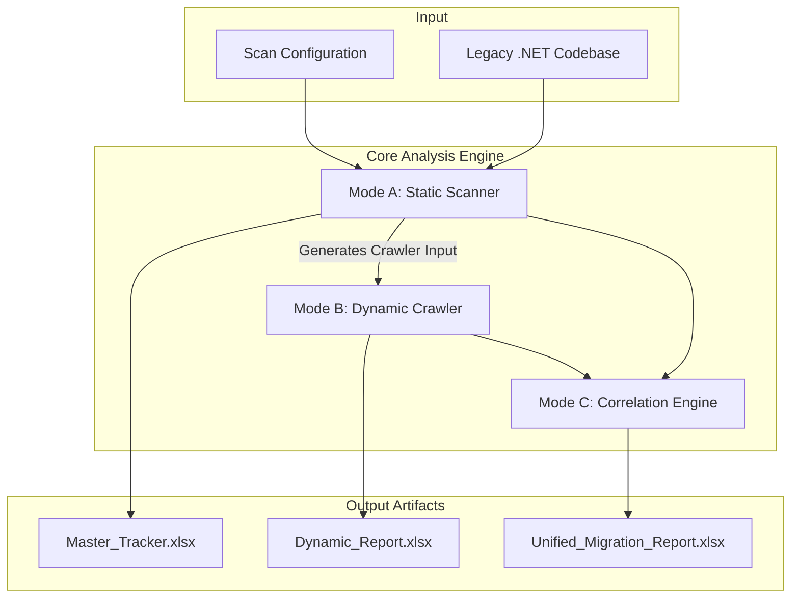
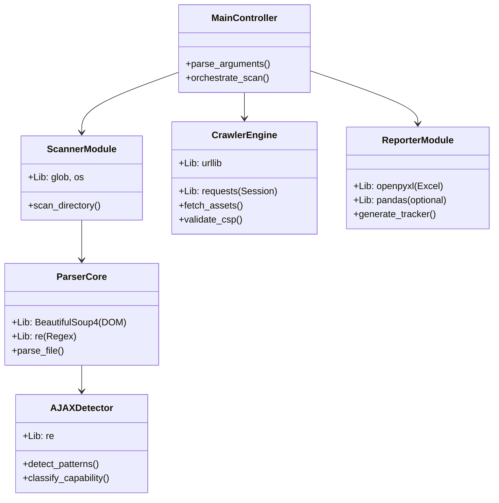

# Analysis Module Implementation Plan (Master Design)

**Objective**: Build a comprehensive analysis tool for .NET Legacy Applications code migration that combines Static Analysis (Source) and Dynamic Analysis (Crawler) to generate a unified "Migration Tracker".

## 1. System Architecture

The utility operates in three distinct modes, powered by a modular Python-based architecture.

### High-Level Workflow

### Component Architecture & Tech Stack
The system is built using **Python 3.9+** and leverages the following modules and libraries:

---

## 2. "Master Tracker" Excel Specification
The output file will have the following structured tabs:

### Tab 1: Comprehensive Findings ("The Code Inventory")
*   **Purpose**: Raw inventory of every detectable asset.
*   **Columns**:
    1.  **File Path**: `Views/Home/Index.cshtml`
    2.  **Type**: `Inline JS`, `Script Block`, `CSS`, `AJAX`
    3.  **Source Type**: `Inline`, `Internal (Local)`, `External`
    4.  **Lines**: `10-25`
    5.  **Snippet**: First 100 chars of code.

### Tab 2: AJAX Detailed Report ("The Logic Map")
*   **Purpose**: Distinguish "Real" migration work from configuration noise.
*   **Columns**:
    1.  **File**: `UserService.js`
    2.  **Snippet**: `$.ajax({ url: ... })`
    3.  **Is Real AJAX?**: `Yes` (Trigger) / `No` (Config/Setup)
    4.  **Endpoint**: `/api/users/get` (or `Dynamic/Variable`)
    5.  **Capability**: `Data Exchange`, `UI Injection`
    6.  **Difficulty**: `Easy` (JSON), `Hard` (Script Injection)

### Tab 3: Crawler Input Generation ("The Hand-Off")
*   **Purpose**: Ready-to-use list for Mode B (Dynamic Scan).
*   **Logic**: Filters Tab 1 for `.aspx`, `.html` files and formats them as URLs.
*   **Columns**:
    1.  **Target URL**: `http://localhost/Views/Home/Index.cshtml` (Mapped from File Path)
    2.  **Rationale**: `Contains 5 Inline Scripts` (Prioritize heavy pages)

### Tab 4:Refactoring Assessment ("The Strategy")
*   **Purpose**: Can this code be moved, or must it be rewritten?
*   **Columns**:
    1.  **Status**:
        *   🟢 **Ready**: Pure Logic (Move to TS/JS file).
        *   🟡 **Rewrite**: Contains `document.write`, `onclick`. (Extract Logic, make Component).
        *   🔴 **Blocked**: Contains Server Code (`@Model`, `<% %>`). (Backend API required first).
    2.  **Blocker Detail**: "Contains Razor `@Url.Action` - Needs API Endpoint".
    3.  **Action Plan**: "Extract logical function `validate()` from `onclick`".

### Tab 5: CSP & Correlation (Combined Mode Only)
*   **Purpose**: What did potential runtime checks find that static missed?
*   **Columns**:
    1.  **Origin Page**: `Login.aspx`
    2.  **Resource**: `https://analytics.google.com/ga.js`
    3.  **Detection Method**:
        *   `Static`: Found in `<script src="...">`
        *   `Dynamic`: Found via Runtime Injection (Crawler)
    4.  **CSP Action**: "Add to `script-src` whitelist".

---

## 3. .NET Legacy Specifics (Priority)

*   **Server-Side Blockers**:
    *   `@Model.*`, `@ViewBag`, `@ViewData` (Razor)
    *   `<%= %>`, `<% %>` (WebForms/Classic ASP)
    *   `runat="server"` (WebForms Controls)
*   **Legacy AJAX Patterns**:
    *   `UpdatePanel`, `ScriptManager` (Partial Rendering)
    *   `PageMethods.MyFunction()` (RPC)
    *   `__doPostBack(...)` (Postback wiring)

## 4. Implementation Workflow (.NET Focus)

1.  **Build Analysis Module**:
    *   Enhance regex parser with the .NET patterns above.
    *   Implement "Crawler Input" generator (File Path -> URL Mapper).
2.  **Build Correlation Engine**:
    *   Logic to compare Static Inventory vs Dynamic Crawler Logs.
3.  **Refactoring Logic Module**:
    *   Categorizer that reads `.cshtml` / `.aspx` and flags the "Blocked" status accurately.

Once this **Analysis Module** is approved and built, we proceed to the **Refactoring Module** (Automated Code Extraction).
