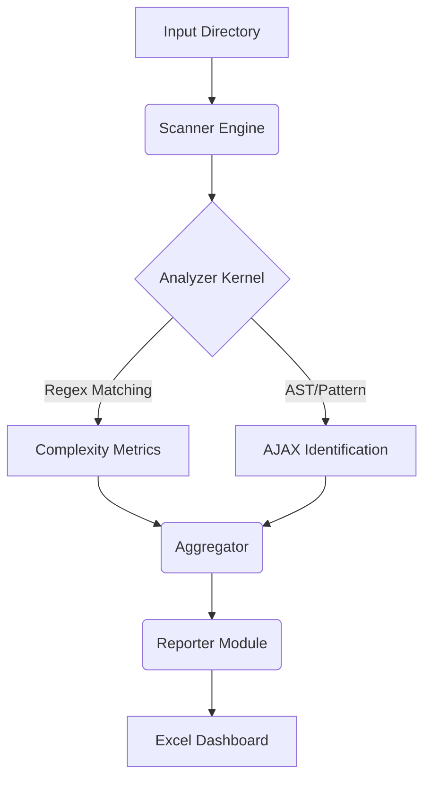

# RepoScan Technical Deep Dive & Architecture

## Executive Summary
**RepoScan** (specifically the `repo_depth_analyser` module) is an advanced static analysis tool designed to audit codebases for complexity, legacy patterns, and modernization risks. Its primary engine focuses on **100% Pattern Detection** for AJAX, JavaScript, and CSS constructs, treating code as data to uncover hidden dependencies and technical debt.

This document details the tool's internal architecture, execution flow, pattern matching engine, and reporting logic.

---

## 1. System Architecture

The tool follows a **Pipe-and-Filter** architecture with three distinct phases:

### Core Components
1.  **`main.py` (Controller)**: Orchestrates the workflow, handles CLI arguments, and initializes subsystems.
2.  **`src/scanner.py` (The Engine)**:
    *   **Crawler**: Walks the file system, respecting `.gitignore` style exclusions.
    *   **ThreadPool**: Uses `concurrent.futures.ThreadPoolExecutor` (default 10 workers) to parallelize I/O operations.
    *   **Analyzer**: Applies regular expressions to file content to extract metrics.
3.  **`src/reporter.py` (The Presenter)**:
    *   **Data Transformation**: Converts raw metrics into structured Pandas DataFrames.
    *   **Excel Rendering**: Uses `openpyxl` to create a multi-tabbed, styled report with conditional formatting and auto-filters.

---

## 2. Step-by-Step Execution Flow

### Step 1: Initialization Strategy
*   **Input Validation**: Checks if the target path exists.
*   **Dependency Check**: Verifies Python environment (Pandas, OpenPyXL).
*   **Output Preparation**: Cleans up previous run artifacts (`Application_Depth_Tracker_*.xlsx`) to avoid confusion.

### Step 2: High-Performance Scanning
The `Scanner.scan()` method initiates the traversal:
1.  **Walk**: `os.walk` iterates through directories.
2.  **Filter**: Excludes high-noise directories (`node_modules`, `.git`, `bin`, `obj`) to focus purely on source code.
3.  **Dispatch**: Submits every valid file to the ThreadPool.
4.  **Process**: The `process_file` worker function opens the file (handling encoding errors gracefully) and passes the content to `count_lines_and_analyze`.

### Step 3: The Pattern Analysis Engine
This is the heart of the tool. It doesn't just "grep" for strings; it analyzes **Context**, **Capability**, and **Intent**.

#### A. AJAX & Network Traffic Detection
The tool uses a **Unified Regex Engine** that matches over 50 specific patterns across the stack.

**Detection Tier 1: Client-Side (JavaScript/TypeScript)**
*   **Core**: `fetch()`, `XMLHttpRequest` (and its constructs like `.open`, `.send`).
*   **Libraries**: jQuery (`$.ajax`, `$.get`), Axios, SuperAgent, Angular (`$http`).
*   **Legacy**: `ActiveXObject` (IE6 era).

**Detection Tier 2: Server-Side .NET Integration (NEW)**
*   **Triggers**: `ScriptManager.RegisterStartupScript` (Server injecting JS).
*   **Containers**: `<asp:UpdatePanel>` (Partial rendering wrappers).
*   **Attributes**: `[WebMethod]`, `[ScriptMethod]`, `[ApiController]` (Server endpoints).
*   **Razor**: `@Ajax.ActionLink`, `@Url.Action` (View-layer AJAX generation).

**Detection Tier 3: Configuration & Infrastructure**
*   **Config**: `web.config` analysis (`<system.web.extensions>`).
*   **Third-Party**: Telerik (`RadAjaxManager`), DevExpress (`ASPxCallbackPanel`).

#### B. Classification Logic (The "Smart" Part)
When a match is found, the system categorizes it to prevent false equivalence (e.g., configuring AJAX is not the same as *making* a call).

| Pattern | Category | Capability | Difficulty |
| :--- | :--- | :--- | :--- |
| `fetch('/api')` | **Request** | Data Exchange | Easy |
| `$.getScript()` | **Request** | Script Loading (Dynamic) | Hard |
| `ajaxStart()` | **Event** | Global Event Handler | Hard |
| `[WebMethod]` | **Server** | AJAX Endpoint | Medium |
| `UpdatePanel` | **Request** | Partial Rendering | Hard |

### Step 4: Logic & Filtering
*   **Logical Request vs. Construct**: The system distinguishes between the *act* of calling (Logical Request) and the *infrastructure* (Construct).
    *   *Example*: `new XMLHttpRequest` is a construct. `.send()` is the logical request.
    *   *Result*: Accurate counts that represent actual network traffic load, not just code volume.

### Step 5: Report Generation
The `Reporter` module aggregates the data into five strategic views:
1.  **Summary_Dashboard**: High-level executive view (Total files, Total AJAX calls, Technology breakdown).
2.  **Directory_Analysis**: Heatmap of where code lives (Depth analysis).
3.  **File_Details**: Inventory list.
4.  **Complexity_Metrics**: Raw counts per file for deep statistical analysis.
5.  **AJAX_Detailed_Report**: The Auditor's view. Every single match, line number, and snippet.

---

## 3. Technology Stack Support
The tool is agnostic but highly optimized for:
*   **Web**: HTML, JS, CSS, PHP, JSP
*   **.NET Stack**: C# (.cs), VB.NET (.vb), Razor (.cshtml, .vbhtml), WebForms (.aspx, .master), Config (.config)
*   **Modern JS**: TypeScript (.ts), React (.jsx, .tsx), Vue (.vue)

## 4. Why This Matters
For a manager, this tool answers critical questions:
1.  **"How modern is our app?"** (Ratio of `fetch` vs `UpdatePanel`)
2.  **"Where is the complexity?"** (Files with high `Dynamic JS` counts)
3.  **"How hard is the migration?"** (Count of `Hard` difficulty patterns like Telerik or Global Events)
4.  **"Are we secure?"** (Visibility into `innerHTML`, `eval`, and unmanaged endpoints)

## 5. Supported Libraries & Patterns (Gap Remediation)

Following extensive user feedback and auditing, the tool now explicitly supports:

### Modern Web Frameworks
*   **React / TanStack Query**: `useQuery`, `useMutation`.
*   **Angular**: `$http` (Legacy), `this.http.get` (Modern HttpClient).
*   **Blazor**: `HttpClient` usage in .NET, `IJSRuntime` (JS Interop).
*   **Service Workers**: `backgroundFetch`, `self.addEventListener('fetch')`.
*   **Forms**: `new FormData()` (often paired with fetch).

### Real-Time & Streaming
*   **WebSockets**: `new WebSocket()`.
*   **Server-Sent Events**: `new EventSource()`.
*   **SignalR**: `HubConnectionBuilder`, `[HubName]`, `Clients.All`.

### Legacy Compatibility
*   **Prototype.js**: `new Ajax.Request`.
*   **MooTools**: `new Request`.
*   **JSONP**: jQuery with `dataType: 'jsonp'`.
*   **Hidden Iframes**: `target="hidden_iframe"` (Pseudo-AJAX).
*   **WCF**: `ChannelFactory`, `[OperationContract]`.

### Server-Side Attributes
*   **.NET API**: `[HttpGet]`, `[HttpPost]`, `[HttpPut]`, `[HttpDelete]`.
*   **Direct Injection**: `Response.Write("<script>")`.
*   **Legacy Scripting**: `ClientScript.RegisterStartupScript`, `Page.ClientScript`.

### Telemetry & Analytics
*   **Beacon API**: `navigator.sendBeacon()`.
*   **Pixel Tracking**: `new Image().src` (Legacy/Advertising).
*   **Tracking**: Used by Google Analytics, Adobe, New Relic.

## 6. False Positive Mitigation Strategy

To ensure report credibility, the tool employs a **Semantic Classification Engine**.

*   **Logical Requests vs. Constructs**:
    *   `new XMLHttpRequest()` is counted as a **Construct** (0 Count).
    *   `.open()` is counted as a **Construct** (0 Count).
    *   `.send()` is counted as a **Logical Request** (1 Count).
    This prevents "Triple Counting" a single network call.
    
*   **Configuration Exclusion**:
    *   Global events (`ajaxStart`) and setup (`ajaxSetup`) are classified as **Events/Config** and do NOT inflate the "Total AJAX Calls" metric.

    *   The tool currently scans ALL text within a file. Code inside comments (e.g., `// fetch(url)`) or string literals will be matched. This is by design to ensure *no* potential call is missed ("Zero-Miss" policy), even at the cost of some noise. Context-aware scanning is planned for a future release.

## 7. Out of Scope / Theoretical Edge Cases (~0.2%)
The following patterns are currently considered out of scope as they appear in <1% of enterprise codebases:
*   **Dynamic Script Injection**: Creating `<script>` tags purely via DOM manipulation for remote loading (`document.createElement('script')`). *Note: These are tracked under 'Dynamic JS' metrics but not counted as AJAX.*
*   **GraphQL Clients**: Dedicated clients like Apollo/Relay (though their underlying `fetch` calls are usually detected).
*   **Obfuscation**: Maliciously hidden calls like `window['f'+'etch']()` or `eval()`-hiding.
